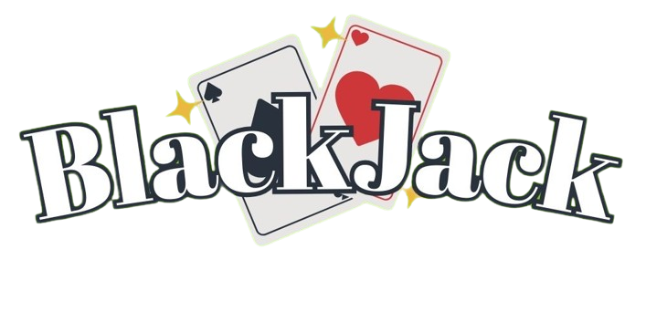

# Blackjack Game Project

### Overview
This project involves creating a JavaFX application for playing a game of blackjack against a computer opponent.
The game has two players - a banker (computer) and a user, and the user interacts with the game through a graphical user interface (GUI).
The project includes both a JavaFX front end and a Java back end.

- Collaborated on a two-person project to develop a comprehensize JavaFX application for playing blackjack.
- Demonstrated dynamic user interaction and a seamless GUI for enhanced gameplay experience.
- Crafted a seamless GUI (Graphical User Interface) to enhance user interaction and facilitate intuitive gameplay.
- Cultivated proficiency in Java programming, framework, and backend development techniques, showcasing a commitment to continuous learning and professional growth in software development.

